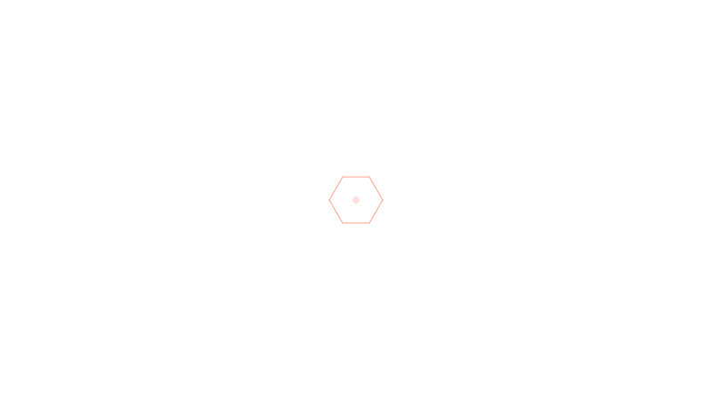
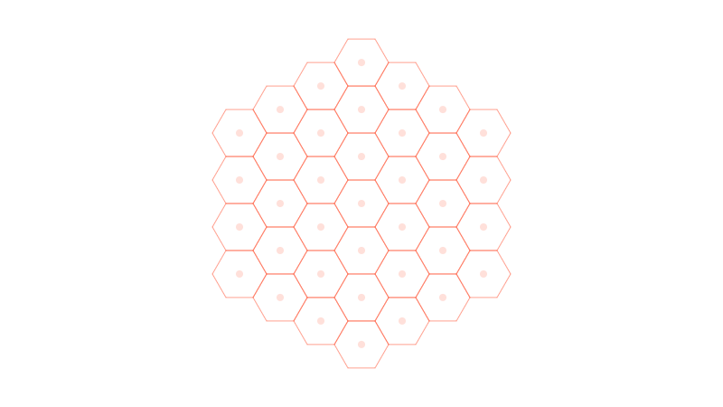

# [OffscreenCanvas] experiment

> [!NOTE]
>
> This is an experimental drawing of hexagonal grid using `OffscreenCanvas`. It
> contains much more complex code than needed to create a simple hexagonal grid
> just with `HTMLCanvasElement`. The purpose of this experiment is to test the
> performance of `OffscreenCanvas` and to learn how to use it.

> [!TIP]
>
> It's recommended to run Nuxt.js in development in [https] mode. To do this,
> create a `~/.nuxtrc` file with the following content:
>
> ```env
> # I'm using WSL2, so the paths are the following
> devServer.https.key=/mnt/c/Users/NandorDudas/localhost+3-key.pem
> devServer.https.cert=/mnt/c/Users/NandorDudas/localhost+3.pem
> ```
>
> To create the key and certificate files, use [mkcert] and follow the
> instructions.
>
> 🤫 and all your Nuxt.js projects will runs with https mode.

## What's happening here?

This is a simple hexagonal grid drawn on a canvas. The grid is drawn using
`OffscreenCanvas` and the main canvas is used to display the grid. The grid is
drawn on the offscreen canvas and then the offscreen canvas is transferred to
the main canvas.

Application is started at `app.vue`, uses the index page to display the canvas
and the grid is drawn at `components/app/CanvasWrapper.vue` component in client
only mode. This is required because `Worker` is not available in the server
environment. And of course the page has wrapped in a layout.
The `components/app/CanvasWrapper.vue` component uses the
`components/app/Canvas.vue` component to display the canvas. The `Canvas.vue`
component is responsible for drawing the grid on the canvas.
There are some composable functions in the `composables` directory to handle
canvas and worker related tasks.

The worker is living in the `lib/workers/hexagonal-grid` directory and it's
responsible for drawing the grid on the offscreen canvas. The worker is created
in the `composables/use-worker.ts` composable function and the worker is used
in the `components/app/CanvasWrapper.vue` component.
For easier development, the worker is reloaded on every change in the worker
but this HMR behavior can be distorbing, so it's recommended to export event
listeners from the worker file.

> [!INFO]
>
> Every time the worker is reloaded, the Tailwind CSS JIT compiler is
> recompiling the CSS files and an error is thrown.

> [!NOTE]
>
> There are some boilerplate code in the `lib/hexagonal-grid` directory to
> make the messaging between the main thread and the worker easier. The
> emitter and setting classes are used to it.

You can check only the `lib/hexagonal-grid/runner.ts` file to see the drawing
mechanism of the hexagonal grid. Other files can be checked to see how the
application is built.

Mouse coordinates are used inside the worker with [SharedArrayBuffer] to
highlight the hovered hexagon. The hovered hexagon is drawn on the main canvas
and the offscreen canvas is transferred to the main canvas.
I chose this method to use the mouse coordinates because the worker is not
able to access the mouse events.

<details>
<summary>Click to see the hexagonal grid</summary>






</details>

## How to run this project?

1. Clone this repository.
2. Run `pnpm install` to install the dependencies.
3. Run `pnpm dev` to start the development server.

> [!TIP]
>
> Try to use [ni].
>
> ```bash
> npm install --global @antfu/ni
> ```

[OffscreenCanvas]: https://developer.mozilla.org/en-US/docs/Web/API/OffscreenCanvas
[mkcert]: https://github.com/FiloSottile/mkcert
[https]: https://nuxt.com/docs/api/nuxt-config#https
[ni]: https://github.com/antfu-collective/ni
[SharedArrayBuffer]: https://developer.mozilla.org/en-US/docs/Web/JavaScript/Reference/Global_Objects/SharedArrayBuffer
